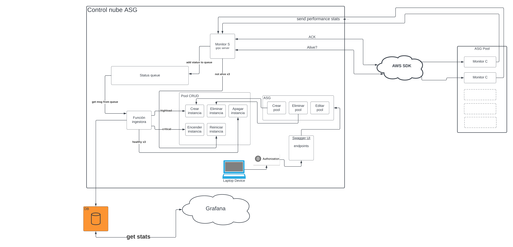

# ST0263 Tópicos Especiales en Telematica

# Estudiantes: 
- Mauricio Escudero, mescude1@eafit.edu.co
- Jose Alejandro Sánchez Sánchez, jasanchez@eafit.edu.co
- Edison Alejandro Torres Muñoz, eatorresm@eafit.edu.co
#
# Profesor: Edwin Nelson Montoya Munera, emontoya@eafit.edu.co

# Proyecto 2
#
# 1. Breve descripción de la actividad
La actividad consistirá en diseñar e implementar un servicio de autoescalamiento que operará sobre instancias EC2 de AWS de Amazon. El objetivo es lograr una alta disponibilidad y rendimiento en el sistema distribuido mediante el uso de balanceadores de carga y grupos de autoescalamiento.

El proyecto comprenderá tres componentes principales:

1. MonitorS: Este proceso principal de monitoreo se encargará de consultar periódicamente el estado de vivacidad y carga de las instancias de aplicación (AppInstance). Correrá un proceso llamado MonitorC, el cual ofrecerá varios servicios mediante una API hacia el MonitorS. Las comunicaciones entre MonitorS y MonitorC se realizarán a través de gRPC.

Algunos de los servicios que se implementarán en MonitorC incluyen el Ping/Pong o Heartbeat para detectar la vivacidad de las instancias de la AppInstance, el servicio GetMetrics para obtener métricas como la carga de la máquina, y los servicios de Registro y Desregistro del MonitorS. Además, se podrán definir y diseñar otros servicios según sea necesario.

2. ControllerASG: Este proceso o aplicación se ejecutará en la misma instancia que MonitorS y tendrá acceso a toda la información recolectada por este a través de memoria compartida. El ControllerASG se comunicará con el API SDK de la nube para ejecutar diversas funciones de Infraestructura como Código. En este caso, se requerirá acceder únicamente al servicio de gestión de instancias EC2.
Antes de utilizar el ControllerASG, será necesario instanciar una máquina EC2 con el software base, la AppInstance y el agente MonitorC. Se deberá definir un mecanismo de configuración de la IP o URL o un servicio de localización del MonitorS. A partir de esta instancia, se creará una imagen AMI personalizada que servirá de base para la creación de nuevas instancias por parte del ControllerASG.

El ControllerASG deberá configurar parámetros como el hardware (uso de t2.micro), disco duro (EBS), VPC, Security Group y Key Pair. Además, se deberán definir los valores de minInstances (no menor a dos), maxInstance (máximo de 5 debido al tipo de cuenta AWS Academy) y las políticas de creación y destrucción de instancias. También se requerirá establecer un mecanismo de almacenamiento de toda la información de configuración en el ControllerASG.

3. Otros componentes: Además de los dos componentes anteriores, se podrán definir otros servicios o procesos que sean necesarios para el diseño e implementación del sistema de autoescalamiento. Estos componentes adicionales se determinarán en base a los requerimientos específicos del proyecto. En este caso se utilizara la base de datos de GCP para almacenar los datos.

En resumen, la actividad consistirá en diseñar, implementar y configurar un sistema de autoescalamiento que operará sobre instancias EC2 de AWS. Se utilizarán balanceadores de carga y grupos de autoescalamiento para lograr una alta disponibilidad y rendimiento en el sistema distribuido.

#
# 1.1. Que aspectos cumplió o desarrolló de la actividad propuesta por el profesor (requerimientos funcionales y no funcionales)

# 1.2. Que aspectos NO cumplió o desarrolló de la actividad propuesta por el profesor (requerimientos funcionales y no funcionales)

# 2. Información general de diseño de alto nivel, arquitectura, patrones, mejores prácticas utilizadas.

# 3. Descripción del ambiente de desarrollo y técnico: lenguaje de programación, librerias, paquetes, etc, con sus numeros de versiones.

# 3.1. Como se compila y ejecuta.

# 3.2. Detalles del desarrollo.

# 3.3. Detalles técnicos

# 3.4. Descripción y como se configura los parámetros del proyecto (ej: ip, puertos, conexión a bases de datos, variables de ambiente, parámetros, etc)

# 3.5. Detalles de la organización del código por carpetas o descripción de algún archivo. (ESTRUCTURA DE DIRECTORIOS Y ARCHIVOS IMPORTANTE DEL PROYECTO, comando 'tree' de linux)

# 4. Descripción del ambiente de EJECUCIÓN (en producción) lenguaje de programación, librerias, paquetes, etc, con sus numeros de versiones.

# IP o nombres de dominio en nube o en la máquina servidor.

## descripción y como se configura los parámetros del proyecto (ej: ip, puertos, conexión a bases de datos, variables de ambiente, parámetros, etc)

## como se lanza el servidor.

## una mini guia de como un usuario utilizaría el software o la aplicación

## opcionalmente - si quiere mostrar resultados o pantallazos 

# 5. otra información que considere relevante para esta actividad.

# referencias: